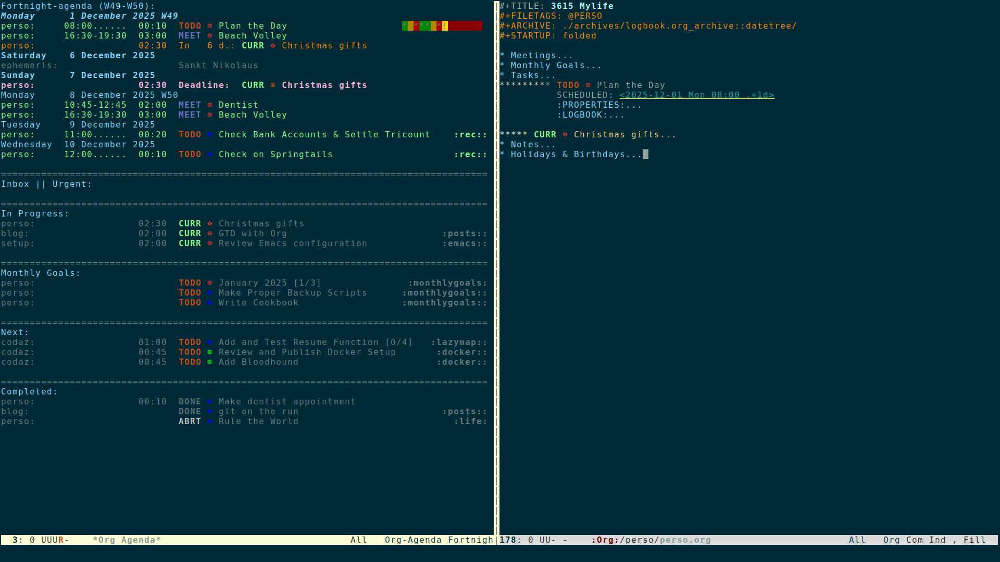

#+TITLE: Getting Things Done with Org
#+DATE: [2025-12-03 Wed]
#+INCLUDE: ../../templates/post.org

#+begin_preview
/Yet-another-GTD-post/ featuring Emacs's Org-mode where I describe my personal
setup. It is rather minimalist and can be easily extended to fit different
workflows.
#+end_preview

I wrote this mostly for my own documentation, but I would be happy if
the reader can get a tip or two out of it. Links to more advanced setups are
provided at the [[./gtd-with-org.html#resources][end]] of this post.

*Table of Contents:*
#+TOC: headlines 2 local

* Rationale
:PROPERTIES:
:CUSTOM_ID: rationale
:END:

I won't talk too much about the added values of "Getting Things Done" (GTD) and
other organization/productivity enforcement strategies as there already exists
plenty of literature about such topics. Everyone has their own personal needs,
ways to organize themselves, yaddi yaddi yadda, you know the drill. So I will
just highlight the benefits that I /personally/ draw out of using a GTD
"system":

- *Increased efficiency*: Tasks are clearly defined, prioritized and
  categorized. They contain enough information to get started immediately
  without losing too much time and risking getting distracted in the process.
  While planning ahead, it is easy to determine which actions have to be taken
  and avoid the unnecessary idle time spent ordering all the items mentally to
  figure out what to do next.

- *Clear mind*: Important tasks are written down and saved on a device which
  saves the mental charge of having to remember them. This helps reducing the,
  sometimes unconscious, stress and anxiety. Clearing the back of my mind from
  non-important noise allows me to be more committed and focused on the current
  matter.

- *Tracking*: There is a record of the most important things that happened. This
  record can be searched through in order to look up something specific or just
  to see how some things evolved over longer periods of time.

By GTD "system" I mean any device, digital or physical, that is used to track
down the progress of one's tasks, goals, projects, notes and so on. I chose to
implement mine with Emacs' [[https://orgmode.org/][Org-Mode]]. Not only does it integrate well with my
existing setup as I use it already for its markup language, the "system" also
only consists of good old plain text files. This ensures me that I will still be
able to work with it in 37 years, somehow, even after the second zombie
apocalypse nearly killed us all. It can also pretty easily be
version-controlled, backed-up and encrypted (for which I use [[https://git-scm.com/][git]], [[http://duplicity.nongnu.org/][duplicity]] and
[[https://gnupg.org/][GnuPG]] respectively).

The rest of this post will describe how these functionalities can be implemented
with Org. The Elisp code shown is complete and can easily be reused and
personalized. It also reflects the overall approach that I had: just roll-out a
simple functional system and then organically adapt it to fit the desired
requirements and workflows. Most of it is directly taken from the sources
mentioned [[#resources][below]] or from the [[https://orgmode.org/manual/][Org manual]]. I highly recommend you check them out!

* Workflow Overview
:PROPERTIES:
:CUSTOM_ID: workflow
:END:

The most central piece is certainly my custom /agenda view/. At the top is a
calender displaying scheduled tasks and upcoming deadlines for the next 14 days.
Underneath is a list of on-going and pending tasks, sorted by status, priority
and effort estimate. I keep this view constantly open and update the tasks from
there as I work on them.

Each task can be given a TODO status, several tags, a priority and an effort
estimate. The agenda view makes it very convenient to filter the tasks according
to these properties. Thus I can easily switch from an exhaustive listing of all
tasks to a more focused view of what currently matters to me. From the agenda
view it is also quite straightforward to change a task's status, reschedule it
or add notes to it. If new tasks, appointments or ideas arise, they can quickly
be added to my /inbox/ with /org-capture/ from anywhere within Emacs.

At the end of the day, I try to take 5-10 minutes to clean-up my /inbox/. I add
more information to the tasks or notes that came in and refile them to the
relevant Org files. I use this time to go through my todos, adjust priorities
and (re)schedule items /when it makes sense/.

I perform a monthly review of all my Org files. I check the logs and archive
completed tasks. I go through each file and check whether notes can be turned
into tasks or vice versa. I also review my short-term goals and reorganize my
todos if needed.

Overall, I try to keep my agenda and todos to a minimal. I only create tasks
from things that I actually /have to/ do. For the rest, I rather take notes and
consult them whenever it's relevant. Furthermore, I am not a big fan of
overplanning. I only schedule tasks and assign deadlines when it's absolutely
necessary, when exterior circumstances force me to it (appointments,
administrative deadlines, etc.). I prefer to carry around a small list of todos
(if I run out of tasks I know where to find more, don't worry about me..) rather
than a huge backlog of tasks that is hidden from me because the tasks are
scheduled for the future without any solid justification.

#+begin_quote
Don't overload your agenda with tasks, don't overload tasks with details, don't
mix tasks and notes - that's basically it.
--- [[https://bzg.fr/en/the-zen-of-task-management-with-org/][The Zen Master]]
#+end_quote

* List of Org Files
:PROPERTIES:
:CUSTOM_ID: list-of-files
:END:

I use two setups across my workstations: one dedicated to personal things while
the other is for work. Those two setups are nearly identical so I will just
present how I use the personal one in the rest of this post (this is why
everything is prefixed with /perso/ or /p/).

*** Directories and Files
:PROPERTIES:
:CUSTOM_ID: directories-and-files
:END:

The setup is made out of these files:

#+begin_src terminal
./
├── conf.org                               -- Org configuration file
├── inbox.org                              -- To-be-processed captured items
├── journal.org                            -- For thoughts and life events
├── perso.org                              -- For my day-to-day doings and notes
├── archives/                              -- Where old logbooks and projects go to sleep
│   ├── logbooks/
│   │   ├── logbook.org_archive
│   │   └── logbook_2015-2020.org_archive
│   └── projects/
│       ├── blog.org_archive
│       └── setup.org_archive
└── projects/                              -- Collection of TODOs and notes that
    ├── blog.org                           -- should be tracked over time
    ├── concerts.org
    ├── cookbook.org
    └── setup.org
#+end_src

For my usage, a project is simply a collection of tasks and/or notes related to
a topic. For example I have a project for this blog, another one where I store
my recipes, ... You get the idea. Each project has its own file. My general,
day-to-day activities like appointments, chores and other todos are stored in
*perso.org*.

Completed tasks from my main file, *perso.org*, are archived in
*archives/logbooks/logbook.org* in [[https://orgmode.org/manual/Template-elements.html#FOOT84][datetree format]]. Tasks from projects are
archived in their own file under *archives/projects/project_A.org*.

My configuration file is actually the present file, *conf.org*, that you are
currently reading. I use literate programming to document my configuration in
the form of an Org file. Every code block with the tag =:tangle yes= will be
exported and evaluated thanks to [[https://orgmode.org/worg/org-contrib/babel/intro.html][org-babel]].

#+caption: conf.org
#+begin_src org
,#+begin_src emacs-lisp :tangle yes
(some cool elisp code)
,#+end_src
#+end_src

In my *~/.emacs.d/init.el* I just need to load the Org file with /org-babel/ and
/voilà/, the Org file gets processed and the exported Elisp code loaded.

#+caption: init.el
#+begin_src emacs-lisp :tangle no
(if (file-readable-p "~/org/perso/conf.org")
    (org-babel-load-file "~/org/perso/conf.org"))
#+end_src

Back to this file, *conf.org*, where I create some variables to reference my
files easily in the rest of the configuration.

#+caption: conf.org
#+begin_src emacs-lisp :tangle yes
(setq
 ;; directories
 skw/d-org-perso          (skw/get-file-directory)
 skw/d-org-perso-archives (concat skw/d-org-perso "archives/")
 skw/d-org-perso-projects (concat skw/d-org-perso "projects/")
 ;; files
 skw/f-org-perso          (concat skw/d-org-perso "perso.org")
 skw/f-org-perso-conf     (concat skw/d-org-perso "conf.org")
 skw/f-org-perso-inbox    (concat skw/d-org-perso "inbox.org")
 skw/f-org-perso-journal  (concat skw/d-org-perso "journal.org")
 skw/f-org-perso-logbook  (concat skw/d-org-perso-archives "logbook.org_archive"))
#+end_src

*** Quick Access
:PROPERTIES:
:CUSTOM_ID: quick-access
:END:

I added this to quickly open files that I use frequently with =C-c f p <key>=
(instead of "p", I use the "w" prefix for my work files).

#+caption: conf.org
#+begin_src emacs-lisp :tangle yes
;; perso.org
(global-set-key (kbd "C-c f p p")
                (lambda () (interactive)
                  (skw/open-file-readable skw/f-org-perso)))

;; inbox.org
(global-set-key (kbd "C-c f p i")
                (lambda () (interactive)
                  (skw/open-file-readable skw/f-org-perso-inbox)))

;; logbook.org
(global-set-key (kbd "C-c f p l")
                (lambda () (interactive)
                  (skw/open-file-readable skw/f-org-perso-logbook)))

;; journal.org
(global-set-key (kbd "C-c f p j")
                (lambda () (interactive)
                  (skw/open-file-readable skw/f-org-perso-journal)))

;; conf.org
(global-set-key (kbd "C-c f p c")
                (lambda () (interactive)
                  (skw/open-file-readable skw/f-org-perso-conf)))
#+end_src

* Defining Tasks
:PROPERTIES:
:CUSTOM_ID: tasks
:END:
*** States
:PROPERTIES:
:CUSTOM_ID: tasks-states
:END:

A task has 5 possible states:

- =TODO= for when the task has not been started yet.
- =CURR= and =STOP= for tasks that are either already in progress or on hold.
- =DONE= and =ABRT= for fully completed or aborted tasks.

This is a pretty basic classification but I don't really need more. Having this
separation allows me to filter tasks quickly in [[https://orgmode.org/manual/Agenda-Views.html][agenda views]] (=/=) or [[https://orgmode.org/manual/Sparse-Trees.html][sparse
trees]] (=C-c /=). I define another sequence with =MEET=, =DONE= or =ABRT= to
handle appointments. The reason why I have a separate status keyword is that I
want to be able to track them very carefully so that I don't overlook them. Most
of my =TODO= items could be rescheduled if I somehow cannot work on them. This
is not the case for =MEET= items.

#+caption: conf.org
#+begin_src emacs-lisp :tangle yes
(setq org-todo-keywords
      '((sequence "TODO(t@/!)" "CURR(c@/!)" "STOP(s@/!)" "|" "DONE(d@/@)" "ABRT(a@/@)")
        (sequence "MEET(m@/!)" "|" "DONE(d@/@)" "ABRT(a@/@)")))

(setq org-todo-keyword-faces
      (quote
       (("ABRT" :foreground "gray"       :weight bold)
        ("CURR" :foreground "pale green" :weight bold)
        ("DONE" :foreground "green"      :weight bold)
        ("MEET" :foreground "magenta"    :weight bold)
        ("STOP" :foreground "orange"     :weight bold)
        ("TODO" :foreground "red"        :weight bold))))
#+end_src

I don't use the [[https://orgmode.org/manual/Clocking-Work-Time.html][clocking]] functionality as I haven't identified a proper need for
it in my workflow (yet) but I tend to make heavy use of modifiers (=@= and =!=)
to track when a state change occurred and sometimes add a note to it. I often
document the current status on important todos for when I will resuming the
tasks. Additionally, I like to log every state change as the timeline can be
valuable information while reviewing the task. They can always be deleted before
archiving the task anyway.

Tasks are items that are quite straightforward and can be completed in one go.
For more complex tasks with dependencies, I use nested todos. This hook switches
a =TODO= heading to =DONE= when all its subheadings (i.e. subtasks) are marked
as =DONE=.

#+caption: conf.org
#+begin_src emacs-lisp :tangle yes
(defun skw/org-summary-todo (n-done n-not-done)
  "Switch entry to DONE when all subentries are DONE"
  (let (org-log-done org-log-states)
    (org-todo (if (= n-not-done 0) "DONE" "TODO"))))

(add-hook 'org-after-todo-statistics-hook 'skw/org-summary-todo)
#+end_src

Here are some convenience options related to state changes:

#+caption: conf.org
#+begin_src emacs-lisp :tangle yes
;; This enables fast selection for TODO keywords
;; Hitting "C-c C-t d" will select "DONE" for example
(setq org-use-fast-todo-selection t)

;; Enable logging of the creation of a new TODO item
(setq org-treat-insert-todo-heading-as-state-change t)

;; Log all state changes into the "LOGBOOK" drawer
(setq org-log-into-drawer "LOGBOOK")

;; When no modifier, always log the DONE timestamp
(setq org-log-done 'time)
#+end_src

*** Tags
:PROPERTIES:
:CUSTOM_ID: tasks-tags
:END:

Tags add more context to a task. They are used to perform additional sorting and
filtering with /agenda views/ or /sparse trees/. The following are global tags
that can possibly apply across all my Org files.

#+caption: conf.org
#+begin_src emacs-lisp :tangle yes
(setq org-tag-alist
      '(("@URGENT" . ?u) ;; Items that should be handled immediately
        ("@REFILE" . ?r) ;; Items that should be moved or processed later
        ("@CURR" . ?c))) ;; Items currently in progress
#+end_src

With single key selection, hitting =C-c C-C= on an item will display a prompt in
the minibuffer. From there, pressing the hotkey listed above will assign the
corresponding tag, =space= will clear the current tags and <tab> will prompt for
a tag, showing the pre-existing tags through completion. I use this feature
quite a lot to mark tasks as =@URGENT= or =@REFILE= on-the-fly and have them pop
on top of my priority list in the agenda view.

#+caption: conf.org
#+begin_src emacs-lisp :tangle yes
(setq org-fast-tag-selection-single-key 'expert)
#+end_src

Filetags can be added per file via the directive =#+FILETAGS: <tag>=. Every
single heading of the file will inherit the tag. Every Org file is assigned such
filetags to facilitate differentiating between personal items and work items. If
I find the need for it, I add some additional tags on a per-file-basis manually.

#+caption: conf.org
#+begin_src emacs-lisp :tangle yes
(setq skw/org-filetags '("@PERSO" "@PROJECT" "@WORK"))
#+end_src

*** Priority and Effort
:PROPERTIES:
:CUSTOM_ID: tasks-priority
:END:

Tasks are assigned one of 3 priorities: =A=, =B=, and =C=. Priorities are always
relative to each other /within/ a project, never /across/ projects. Tasks with
priority =A= should be ideally completed before anything else. Then it would be
the turn of =B= and =C= (aka "whenever") tasks. A better looking font-face is
assigned to different priorities with the package [[https://github.com/harrybournis/org-fancy-priorities][org-fancy-priorities]].

#+caption: conf.org
#+begin_src emacs-lisp :tangle yes
(setq org-highest-priority ?A
      org-lowest-priority ?C
      org-default-priority ?C)

(setq org-priority-faces '((?A . "red")
                           (?B . "magenta")
                           (?C . "color-46")))

(use-package org-fancy-priorities
  :ensure t
  :diminish
  :hook
  (org-mode . org-fancy-priorities-mode)
  :config
  (setq org-fancy-priorities-list '("☸" "☸" "☸")))
#+end_src

With /priority commands/ enabled, it's possible to shift a priority of an item
with =S-Up= and =S-Down= from the agenda view or with the cursor on the heading.

#+caption: conf.org
#+begin_src emacs-lisp :tangle yes
;; Allow setting priorities with S-Up / S-Down
(setq org-enable-priority-commands t)
#+end_src

Whenever possible, I use =C-c C-x e= (or =e= in the agenda view) to set [[https://orgmode.org/manual/Effort-Estimates.html][effort
estimates]] on a todo. Knowing how long a task would approximately take is useful
when I need to plan my day. For that I follow my rule of thumb: I take the
amount of time that I /guess/ a task would take and multiply it by 2.

The property is somehow not in uppercase like most of the others, let's fix it.

#+caption: conf.org
#+begin_src emacs-lisp :tangle yes
(setq org-effort-property "EFFORT")
#+end_src

In the end, the combination of priority and effort estimate are mostly used to
provide a sorting strategy in the agenda views. In my case, I often know
on-the-spot which tasks should be tackled first so I don't need to rely on them
too heavily.

*** Habits
:PROPERTIES:
:CUSTOM_ID: tasks-habits
:END:

[[https://orgmode.org/manual/Tracking-your-habits.html][Habits]] are =TODO= items with the property "STYLE" set to "habit", a repeated
scheduled date and logging enabled. The habit below can be done every day, with
a maximum resting period of 3 days.

#+caption: conf.org
#+begin_src org :tangle no
,*** TODO [#C] Work out                                               :health:
SCHEDULED: <2025-11-17 Mon .+1d/3d>
:PROPERTIES:
:STYLE:    habit
:Effort:   00:30
:END:
:LOGBOOK:
- State "DONE"       from "TODO"       [2025-07-25 Fri 17:17]
- State "DONE"       from "TODO"       [2025-07-22 Tue 17:26]
:END:

Or:
- 5x:
  - 10 Push-ups
  - 30 Sit-ups
  - 10 Squats

- Run for 00:30+

- Cycle for 01:30+
#+end_src

I want my habits to be displayed on today's agenda entry only if they are due on
that day or overdue. Tracking them over the last 14 days if enough for my purposes.

#+caption: conf.org
#+begin_src emacs-lisp :tangle yes
(use-package org-habit
  :after org
  :config
  (setq org-habit-show-all-today nil
        org-habit-graph-column 70
        org-habit-preceding-days 14))
#+end_src

* Viewing Tasks
:PROPERTIES:
:CUSTOM_ID: agenda
:END:
*** Agenda Files
:PROPERTIES:
:CUSTOM_ID: agenda-files
:END:

The following files are automatically tracked by the agenda:

#+caption: conf.org
#+begin_src emacs-lisp :tangle yes
(add-to-list 'org-agenda-files skw/f-org-perso)
(add-to-list 'org-agenda-files skw/f-org-perso-inbox)
(add-to-list 'org-agenda-files skw/d-org-perso-projects)
(add-to-list 'org-agenda-files skw/d-org-perso-archives)
#+end_src

*** Skipping Tags and Habits
:PROPERTIES:
:CUSTOM_ID: skipping-tags-and-habits
:END:

These functions can be passed as argument to =org-agenda-skip-function= in order
to ignore specific tags or properties in the agenda views.

#+caption: conf.org
#+begin_src emacs-lisp :tangle yes
(defun skw/agenda-skip-tags (&rest args)
  "Skip tags passed as 'args' in the agenda view"
  (let (beg end)
    (org-back-to-heading t)
    (setq beg (point)
          end (progn (outline-next-heading) (1- (point))))
    (goto-char beg)
    (setq alltags (prin1-to-string (org-get-tags)))
    (goto-char beg)
    (if (-some (lambda (x) (string-match x alltags)) args)
        end)))

(defun skw/agenda-skip-property (proprety value)
  "Skip an agenda entry if it has a 'property' equal to 'value'."
  (let ((subtree-end (save-excursion (org-end-of-subtree t))))
    (if (string= (org-entry-get nil proprety) value)
        subtree-end
      nil)))
#+end_src

*** Custom Agenda Views
:PROPERTIES:
:CUSTOM_ID: custom-agenda-views
:END:

I make use of 6 different sections in my custom agenda view. From top to bottom:

1) Regular calender that spans over 14 days showing scheduled items, habits and
   upcoming deadlines. Habits are shown only on today's entry if they are
   scheduled for today or overdue. They can be hidden with =K=.
2) Directly underneath are all items tagged =@URGENT= or =@REFILE=. I need to
   see these items before anything else to be able to prioritize correctly.
3) Next, there is a list of all on-going tasks. If possible, I try to work on
   these tasks first.
4) I like to set some small goals for myself over a period of 2 months. This
   section displays the current status.
5) All the remaining open todos sorted by priority and effort. I go through it
   every day to make sure that I am not missing anything important.
6) Finally, I have the list of all completed or canceled items. I go through it
   every month and archive items that are not needed anymore.

#+caption: conf.org
#+begin_src emacs-lisp :tangle yes
(setq skw/org-perso-agenda-views
      '(("p" "Perso agenda"
         (
          ;; 1) Agenda over the next 14 days
          (agenda ""
                  ((org-agenda-show-all-dates nil)
                   (org-agenda-use-time-grid nil)
                   (org-agenda-span 14)
                   (org-agenda-start-on-weekday nil)
                   (org-deadline-warning-days 14)
                   (org-agenda-show-log t)
                   (org-agenda-skip-function
                    '(skw/agenda-skip-tags "@WORK"))))

          ;; 2) Inbox
          (tags "@PERSO+@REFILE|@PERSO+@URGENT"
                ((org-agenda-overriding-header "Inbox || Urgent:")))

          ;; 3) In Progress
          (tags-todo "@PERSO+@CURR|@PERSO+TODO={CURR}|@PERSO+TODO={STOP}"
                     ((org-agenda-overriding-header "In Progress:")
                      (org-agenda-skip-function '(or ;; (org-agenda-skip-entry-if 'scheduled)
                                                     ;; (org-agenda-skip-entry-if 'deadline)
                                                     (skw/agenda-skip-property "STYLE" "habit")
                                                     (skw/agenda-skip-tags "monthlygoals")))))

          ;; 4) Remaining Monthly Goals
          (tags "@PERSO+monthlygoals-TODO={DONE}"
                ((org-agenda-overriding-header "Monthly Goals:")))

          ;; 5) Next
          (tags-todo "@PERSO+TODO={TODO}-@REFILE"
                     ((org-agenda-overriding-header "Next:")
                      (org-agenda-skip-function '(or (org-agenda-skip-entry-if 'scheduled)
                                                     (org-agenda-skip-entry-if 'deadline)
                                                     (skw/agenda-skip-property "STYLE" "habit")
                                                     (skw/agenda-skip-tags "monthlygoals")))))

          ;; 6) Completed
          (todo "DONE|ABRT"
                ((org-agenda-overriding-header "Completed:")
                 (org-agenda-skip-function '(skw/agenda-skip-tags "@WORK" "monthlygoals"))))))))

(setq org-agenda-custom-commands
      (append org-agenda-custom-commands skw/org-perso-agenda-views))
#+end_src

Here are the keybindings that I use the most within the agenda view (taken from
[[https://blog.aaronbieber.com/2016/09/25/agenda-interactions-primer.html][Aaron Bieber]]):

- To navigate the agenda:
  - =<tab>=: Opens the selected entry in a new split window and jumps to it.
  - =<enter>=: Same but opens in the current window.
  - =S-f=: Activate "follow mode". This opens a new split window to show the
    selected entry with a highlight, but focus stays on the agenda view. I find it
    quite useful so that I always have more context on the entry that I'm
    currently viewing, without leaving the agenda view. If I really need to jump
    to the item, I press =<tab>=.
  - =sg=: Save the agenda files and rebuild the agenda view. I end up hitting that
    quite a lot out of reflex.
  - =/=: Prompt for a match (category, tag, regex, ...).
  - =v A=: Include archived entries.
  - =v L=: Toggle log mode.
  - =<=: Focus the agenda view on the current category. Extremely useful.
  - =v E=: Add additional context on tasks when possible.
  - =K=: Toggle the display of habits.
  - =v <space>=: Reset the current view to org-agenda-span.

- To edit entries:
  - =C-c C-c=: Add a tag.
  - =t=: Cycle the TODO state of an entry.
  - =e= (or =C-c C-x e=): Set the effort on an entry.
  - =z= (or =C-c C-z=): Add a note to the entry.
  - =+= / =-= (or =S-up= / =S-down=): Increase / decrease the priority of an
    entry.
  - =S-left / S-right=: Shift the scheduled date or deadline of an entry.
  - =C-c C-w=: Refile an entry.
  - =$= (or =C-c C-x C-s=): Archive entry (subtree) to it's corresponding
    archive file.

Some additional agenda tweaks:

#+caption: conf.org
#+begin_src emacs-lisp :tangle yes
;; This simple sorting strategy works for my purposes
(setopt org-agenda-sorting-strategy
        '((agenda time-up deadline-up scheduled-up todo-state-up priority-down)
          (todo todo-state-up priority-down deadline-up)
          (tags todo-state-up priority-down deadline-up)
          (search todo-state-up priority-down deadline-up)))

;; I find it slightly neater this way
(setq org-agenda-prefix-format "%-10:c %-12t %-6e %s")

;; Do not display filetags like =@PERSO= or =@PROJECT= in the agenda views
(setq org-agenda-hide-tags-regexp
      (mapconcat (lambda (x) x) skw/org-filetags "\\|"))
#+end_src

Here is the obligatory screenshot of my agenda view:

#+CAPTION: Custom Agenda View

*** Special Calender Entries
:PROPERTIES:
:CUSTOM_ID: diary
:END:

I use a very simple [[https://orgmode.org/manual/Weekly_002fdaily-agenda.html][calendar integration]] as I'm only interested in holidays and
birthdays.

#+caption: perso.org
#+begin_src org
,* Holidays & Birthdays
:PROPERTIES:
:CATEGORY: ephemeris
:END:
%%(org-calendar-holiday)
%%(org-anniversary 1869 10  2) Mahatma Gandhi (%d)
#+end_src

#+caption: conf.org
#+begin_src emacs-lisp :tangle yes
;; check https://github.com/rudolfochrist/german-holidays for implementation
(setq skw/holidays
      '((holiday-fixed 01 01   "New Year's Day (free)")
        (holiday-fixed 02 14    "Valentine's Day")
        (holiday-fixed 03 17    "St. Patrick's Day")
        (holiday-fixed 04 01    "April Fools' Day")
        (holiday-easter-etc -2  "Easter Friday (free)")
        (holiday-easter-etc 0   "Easter Sunday (free)")
        (holiday-easter-etc 1   "Easter Monday (free)")
        (holiday-easter-etc 39  "Christi Himmelfahrt (free)")
        (holiday-easter-etc 50  "Pfingstmontag (free)")
        (holiday-easter-etc 60  "Corpus Christi / Fronleichnam (free)")
        (holiday-fixed 05 01    "Labor Day (free)")
        (holiday-float 05 4 7   "Mother's Day") ;; needs checking
        (holiday-float 06 4 7   "Father's Day") ;; needs checking
        (holiday-fixed 10 03    "Tag der Deutschen Einheit (free)")
        (holiday-fixed 10 31    "Halloween")
        (holiday-fixed 11 01    "All Saints (free)")
        (holiday-float 11 4 4   "Thanksgiving")
        (holiday-fixed 12 06    "Sankt Nikolaus")
        (holiday-fixed 12 25    "Christmas 1 (free)")
        (holiday-fixed 12 26    "Christmas 2 (free)")
        (holiday-fixed 12 31    "Silverster")

        (holiday-islamic 9 1 "Ramadan Begins")
        (holiday-islamic 1 10 "Ashura")
        (holiday-islamic 3 12 "Mulad-al-Nabi")
        (holiday-islamic 7 26 "Shab-e-Mi'raj")
        (holiday-islamic 8 15 "Shab-e-Bara't")
        (holiday-islamic 9 27 "Shab-e Qadr")
        (holiday-islamic 10 1 "Id-al-Fitr")
        (holiday-islamic 12 10 "Id-al-Adha")

        ;; Equinoxes, solstices and daylight saving time
        (solar-equinoxes-solstices)
        (holiday-sexp calendar-daylight-savings-starts
                      (format "Daylight Saving Time Begins %s"
                              (solar-time-string
                               (/ calendar-daylight-savings-starts-time . #1=
                                  ((float 60)))
                               calendar-standard-time-zone-name)))
        (holiday-sexp calendar-daylight-savings-ends
                      (format "Daylight Saving Time Ends %s"
                              (solar-time-string
                               (/ calendar-daylight-savings-ends-time . #1#)
                               calendar-daylight-time-zone-name)))))

(setq calendar-holidays skw/holidays)
#+end_src

* Working with Tasks
:PROPERTIES:
:CUSTOM_ID: working-with-tasks
:END:
*** Capture
:PROPERTIES:
:CUSTOM_ID: capture
:END:

Adding items to the system is done with org-capture. Pressing =C-c c= anywhere
in Emacs will bring up custom capture templates, prompt for minimal information
and close itself, allowing me to continue doing my previous task where I left it
off.

Everything I capture goes to my *inbox.org* file for later refiling and
processing, except journal entries which get inserted in datetree format in
*journal.org*. The templates are pretty self-explaining, the documentation is
available [[https://orgmode.org/manual/Capture-templates.html][here]].

#+caption: conf.org
#+begin_src emacs-lisp :tangle yes
(setq skw/org-perso-capture-templates
      '(("p" "Perso capture")
        ("pj" "Journal Entry" entry (file+datetree skw/f-org-perso-journal)
         "* %^{date}u %^{title}\n\n  %?\n\n" :tree-type month)

        ("pm" "Meeting" entry (file skw/f-org-perso-inbox)
         "* MEET [#A] %^{meeting} %^g\n  SCHEDULED: %^T\n  :LOGBOOK:\n  - CREATED: %U\n  :END:\n%?\n")

        ("pn" "Note" entry (file skw/f-org-perso-inbox)
         "* %^{item} %^g\n  :LOGBOOK:\n  - CREATED: %U\n  :END:\n%?\n")

        ("pt" "Task" entry (file skw/f-org-perso-inbox)
         "* TODO [#B] %^{task} %^g\n  :LOGBOOK:\n  - CREATED: %U\n  :END:\n%?\n")))

(setq org-capture-templates
      (append org-capture-templates skw/org-perso-capture-templates))
#+end_src

*** Refiling
:PROPERTIES:
:CUSTOM_ID: refiling
:END:

[[https://orgmode.org/manual/Refile-and-Copy.html][org-refile]] is invoked with =C-c C-w= and allows to conveniently move items
across files or headings. The most important files and projects are added to
=org-refile-targets=.

#+caption: conf.org
#+begin_src emacs-lisp :tangle yes
(setq skw/org-perso-refile-targets `((skw/f-org-perso :maxlevel . 5)
                                     (skw/f-org-perso-inbox :maxlevel . 5)
                                     (skw/f-org-perso-journal :maxlevel . 5)
                                     (,(directory-files-recursively skw/d-org-perso-projects "\\.org$") :maxlevel . 5)))
(setq org-refile-targets '())
(setq org-refile-targets (append org-refile-targets skw/org-perso-refile-targets))
#+end_src

My main configuration options are very well explained [[https://blog.aaronbieber.com/2017/03/19/organizing-notes-with-refile.html][here]]. YMMV, so try out for
yourself what work best for you.

#+caption: conf.org
#+begin_src emacs-lisp :tangle yes
(setq org-refile-use-outline-path 'file
      org-outline-path-complete-in-steps nil
      org-refile-allow-creating-parent-nodes 'confirm
      org-refile-use-cache nil)
#+end_src

*** Archiving
:PROPERTIES:
:CUSTOM_ID: archiving
:END:

When a task has been completed or canceled for a while, I don't want to have it
on the radar anymore so I [[https://orgmode.org/guide/Archiving.html][archive]] it away. Items from *perso.org* go into
*archives/logbooks/logbook.org_archive* in [[https://orgmode.org/manual/Template-elements.html#FOOT84][datetree]] format and those from
projects go to *archives/projects/<project.org>*. Hitting =C-c $= on a heading
or =$= on the agenda view will archive the item to the correct location.

From the agenda view, when I want to inspect archived items, I can press =v A l=
(or =v A v L= for a more exhaustive view, with state changes) to add them to the
agenda and then reduce I often reduce the view to a single category with =<=.

Locations are defined using the following in-buffer directives:

#+caption: conf.org
#+begin_src org
,#+ARCHIVE: ./archives/logbooks/logbook.org_archive::datetree/
#+end_src

#+caption: projects/projectA.org
#+begin_src org
,#+ARCHIVE: ../archives/projects/%s_archive::
#+end_src

When archiving, I want to preserve the TODO state, keep existing tags and add
some context. Lastly, I want to save the file after adding an archived item and
still be able to cycle through tree tagged with =:ARCHIVE:=.

#+caption: conf.org
#+begin_src emacs-lisp :tangle yes
(setq org-archive-mark-done nil
      org-archive-subtree-add-inherited-tags t
      org-archive-save-context-info '(time file category todo priority itags olpath ltags)
      org-archive-subtree-save-file-p t
      org-cycle-open-archived-trees t)
#+end_src

* Resources
:PROPERTIES:
:CUSTOM_ID: resources
:END:

- [[https://doc.norang.ca/org-mode.html][Organize Your Life In Plain Text!]]: Very exhaustive documentation by Bernt Hansen.
- [[https://blog.aaronbieber.com/2016/09/24/an-agenda-for-life-with-org-mode.html][An Agenda for Life With Org Mode]]: Focus on Agenda Views by [[blog.aaronbieber.com][Aaron Bieber]] (make
  sure you check out his blog for more tips).
- [[https://bzg.fr/en/the-zen-of-task-management-with-org/][The Zen of Task Management with Org]] by [[https://bzg.fr/en/][Bastien Guerry]].
- [[https://www.philnewton.net/blog/org-agenda-monthly-goals/][Monthly Goals in Org Agenda]] by [[https://www.philnewton.net/][Phil Newton]].
